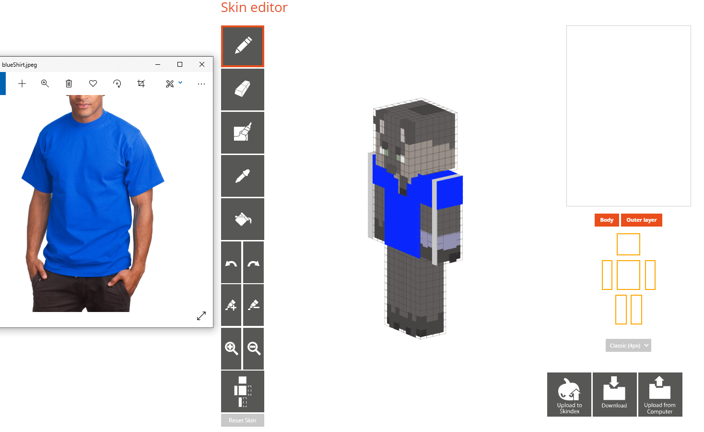
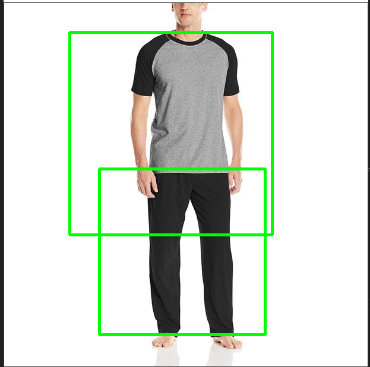
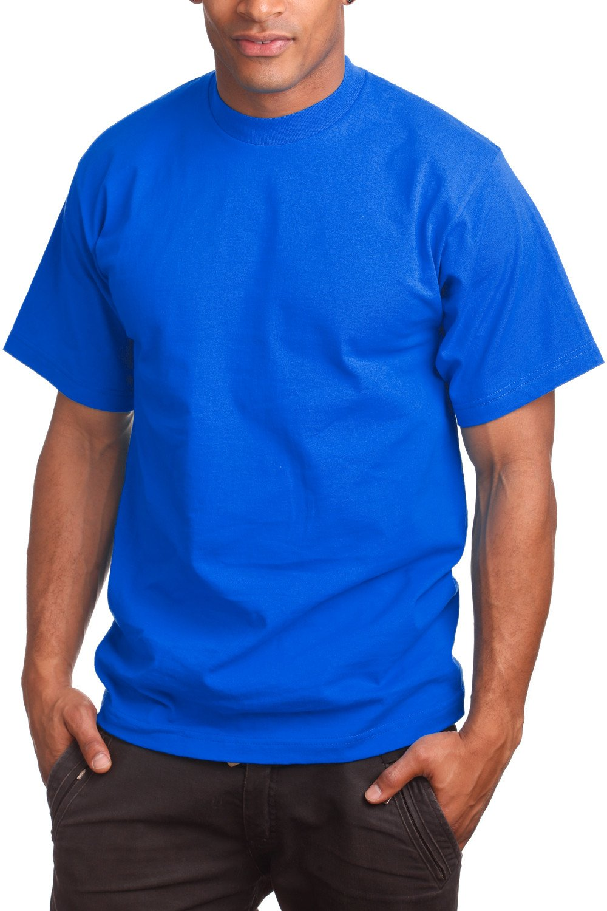
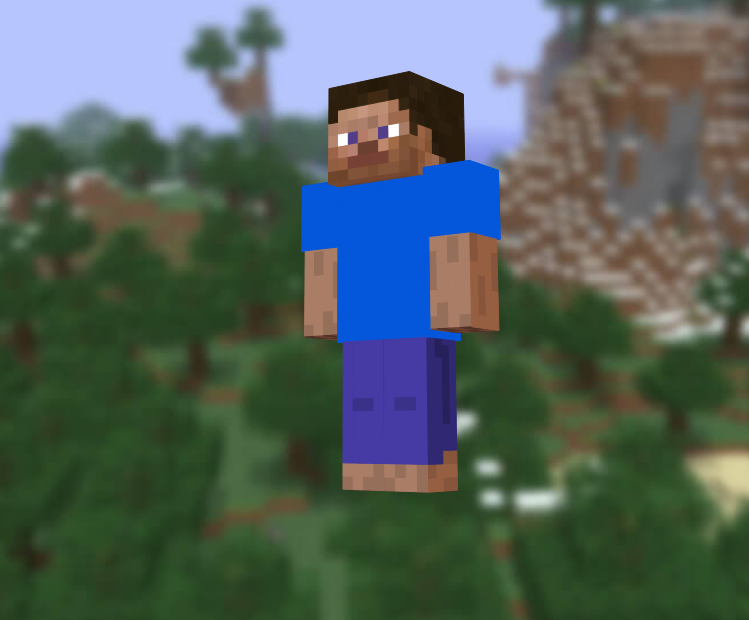
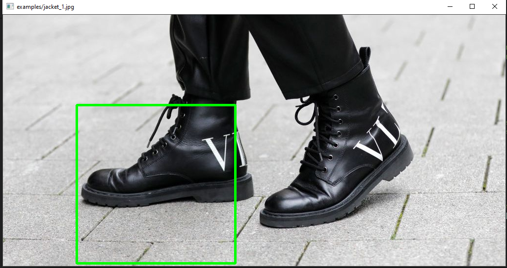
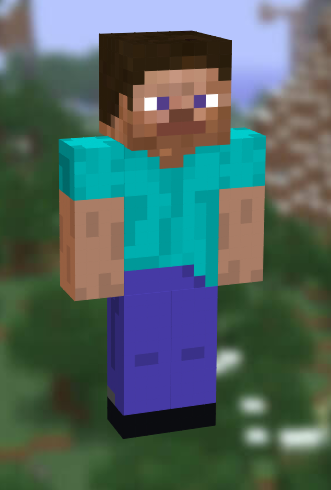
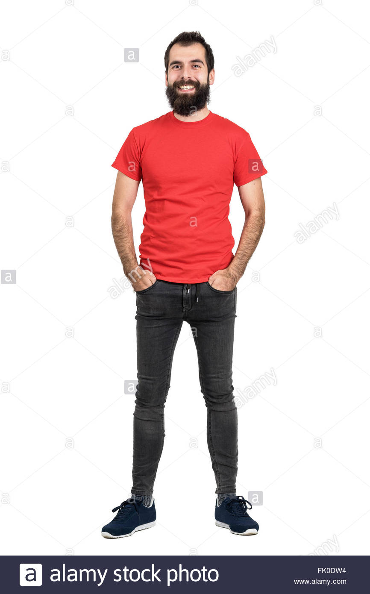
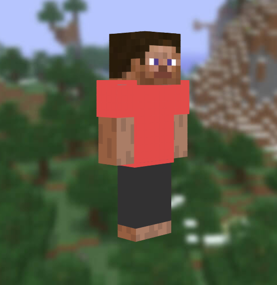
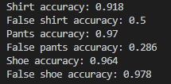

## Video
<iframe width="560" height="315" src="https://www.youtube.com/embed/0M8t6AnGiao" title="YouTube video player" frameborder="0" allow="accelerometer; autoplay; clipboard-write; encrypted-media; gyroscope; picture-in-picture" allowfullscreen></iframe>

# Project Summary
The project we have chosen to approach is parsing images of outfits into corresponding Minecraft skins using computer vision techniques and algorithms. Our overall plan has not changed significantly in its theme since the start of the project, but we notably lost a team member, and so are working as a two-person group now. With that in mind, we have adjusted the scope and complexity of our final version to be more in line with our reduced group size. We are currently planning to support outfits including up to a shirt, pants, and shoes using a standardized Minecraft skin template that we will overlay each clothing piece on.

Currently, creating skins in Minecraft is done using websites that allow the user to paint directly onto a Minecraft character frame one pixel at a time.

This process can be slow and tedious when a user simply wants an entire outfit to be translated into a skin quickly and without hassle.  Minecraft skins are represented as 64 x 64 pixel PNGs that map different regions of the image to various areas of the Minecraft skin.  A user not wanting to use a website could instead paint directly onto these skin images with a program such as Photoshop.  However, the mappings are not intuitive, and public documentation for the precise mappings were found to be inconsistent and incorrect at times.

Using our project, users can run our program with their target image and receive a fully mapped Minecraft skin in a fraction of the time.  Thus, we think this approach will help people quickly create skins from existing photographs instead of spending time to manually create skins on a website or have to figure out the precise coordinate mappings themselves.  

# Approaches
We are using the Haar feature-based cascade classifier (known for learning to detect faces) to detect objects in images. Haar-cascade extracts important features from an image and tests if those features are present in an image. To classify an object in an image, it extracts a smaller part of the whole image and tests if the features are there. The important features are determined during the adaboost training part where features are individually tested and produce an error rate. Important features are placed into multiple stages. These stages are for quickly testing if a spot in an image is our desired object. For example, the classifier zooms in on one part of an image and detects if it has enough features from stage one of the classifier. If it does not, then we stop testing that spot in the image and move on immediately instead of testing that spot for all desired features. For our cascade classifiers, we set it to 10 stages with a "max false alarm rate" of 0.3. This means that while training each stage on positive images, we continue extracting features until that stage can classify incorrectly less than 30% of the time. We used 500 images from the Fashion MNIST dataset for each of our clothing objects and an equal amount of negative images to train our classifier. The shoes had 1500 images since MNIST had 1000 images each for sneakers, boots, and sandals.

However, Haar-cascade is only good for detecting shapes but our project requires color. Initially, we quantized the relevant regions of the shirt/pants/shoes into one discrete color as a way of approximating the true color given light and shadow.  Next, we tried choosing the center of the bounding box as the most approximate color due to problematic behavior if other clothing was included in the bounding box. However, this had its own issues with the background being taken into account and distorting the color, and also cases where the center of the bounding box was not part of the clothing.  Finally, we used k-means clustering to cluster each bounding box into 3 discrete colors, then subtracted the color closest to white (assumed to be the background color), and took the more frequent of the remaining two colors as the color of the clothing item.  This approach balances issues of missing the clothing piece entirely with factoring out background, while having issues if the background is non-white.  Such an issue could be circumvented with a tight border around the clothing piece, but this is infeasible with Haar-cascade.  This requirement of a lighter background would be added as a disclaimer to the user when selecting input images.  We then trained classifiers using the same approach for both pants and shoes. We use OpenCV's functions to detect objects in an image by making rectangles. We use the classifiers to detect the object and get confident weights for each possible detection. We use the most confident detection and extract its color by finding the color value at the center of each bounding box. Then we use the color and map it to the appropriate clothing piece by coloring the default skin at the correct coordinates.

One of the major difficulties we ran into was finding a good clothing dataset with proper annotations, which are images that outline coordinates to an object in an image. We need proper annotations so that our classifier can learn to detect the outlined object from thousands of images. In the end, we had to stick with the Fashion MNIST dataset since all the images were simple clothing objects with no background, and therefore no need for annotations since the whole image is the object. However, this limited dataset has weakened our classifier since the images are simple and not diverse in angles.

We initially looked into other approaches such as CNNs, which we ran with high accuracy (mean=91.175 across all categories of clothing) on the Fashion MNIST validation dataset, but given the necessity for our project of finding an accurate boundary around each clothing piece, we then looked into masked R-CNN.  Here we ran into a lot of difficulty in finding a dataset that can provide all the information that masked R-CNN requires, which includes bounding boxes for each object in an image, prediction confidence or weights from a previously defined model, and an object mask (polygon outline for object). Masked R-CNN is known to be more accurate than Haar Cascade since it makes use of convolutional neural networks, which is the modern approach to machine learning. Haar Cascade is simply for feature extraction and detection on objects whereas Masked RCNN is more detailed image segmentation where we get an outline instead of a rectangle around an object.

# Evaluation
Our classifier can currently detect shirts, pants, and shoes, in that order of accuracy. Below are examples of how our classify works on simple clothing item images and outfits. To test our code qualitatively, we manually used our classifier on images attempting to find the limits of what we are able to classify. Some of our better results can be seen below.  

This shirt translates to this Minecraft skin from our code:

Our shoe classifier is also in a working condition for simple positions as seen in this translation:

This man in a red shirt and dark pants translates to this Minecraft skin:

We can see in our translations that the color is correctly mapped onto the Minecraft skin.  For simple, complete applications such as a solid-colored t-shirt, pants, and shoes with a light background, our project can be readily used to create complete Minecraft skins much more quickly and efficiently than current methods.

To test our results quantitatively, we once again used the Fashion MNIST dataset and negative images. For each of our classifiers, we tested 500 random images of the correct clothing item from the mnist dataset and 500 negative images to see its accuracy. We can see the results below.

It should be noted that the MNIST dataset is only made of simple clothing items on blank backgrounds. Here we can see our classifiers can detect the proper clothing item 90% of the time. However, the false positive rate for the shoe classifier is very high and the false positive for the shirts is slightly high as well. In this case, false positives are when we detect the object but there is no specified object in the images. Specifically, this means our shirt classifier detected an object 50% of the time in negative images, the pants classifier 0.286, and the shoe classifier 0.97. The false positive rate is not necessarily a huge impediment to the use of the project, because users will ostensibly be only passing in images of what they know is clothing to begin with.  However, the shoe classifier need a lot of work before it can be used realistically as it falsely classifies too often. Our pants classifier appears to be the most accurate with a 0.97 accuracy and 0.286 false positive rate.

# References

https://minecraft.novaskin.me/ for Minecraft skin uploading

https://stackoverflow.com/questions/40527769/removing-black-background-and-make-transparent-from-grabcut-output-in-python-ope for making an image with no background.

https://opencv-python-tutroals.readthedocs.io/en/latest/py_tutorials/py_objdetect/py_face_detection/py_face_detection.html OpenCV information about Haar Cascades.

https://docs.opencv.org/2.4/doc/user_guide/ug_traincascade.html the documentation behind OpenCV's Haar Cascade functions.

https://pythonprogramming.net/haar-cascade-object-detection-python-opencv-tutorial/ A tutorial on Haar Cascade.

https://www.kaggle.com/zalando-research/fashionmnist Information on the Fashion MNIST dataset.

https://opencv-python-tutroals.readthedocs.io/en/latest/index.html OpenCV documentation behind a lot of its functionality.

https://github.com/JoakimSoderberg/haarcascade-negatives Negative image dataset.

https://machinelearningmastery.com/how-to-perform-object-detection-in-photographs-with-mask-r-cnn-in-keras/ Attempted Masked RCNN tutorial but could not get it to work.

https://github.com/minotar/skin-spec Introduction to Minecraft skin specifications

https://docs.opencv.org/master/d1/d5c/tutorial_py_kmeans_opencv.html OpenCV k-means clustering information 
